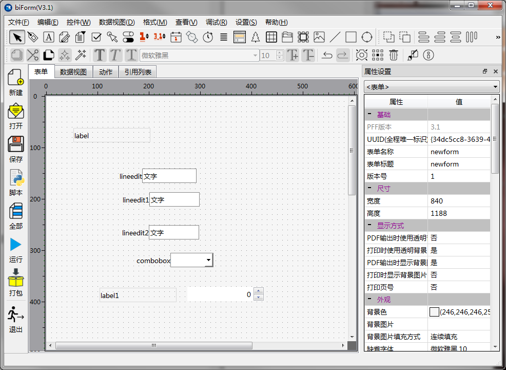
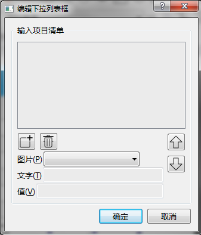
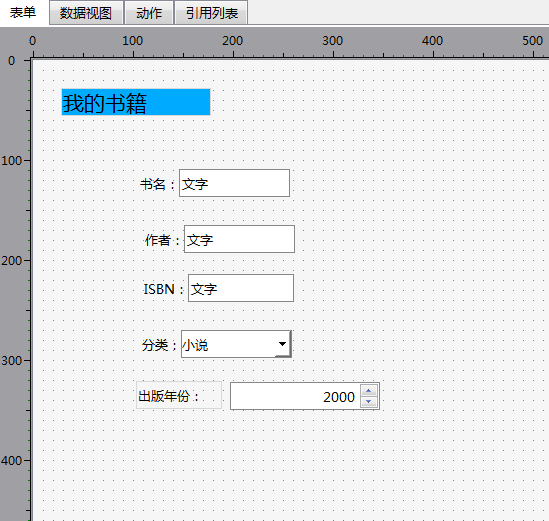
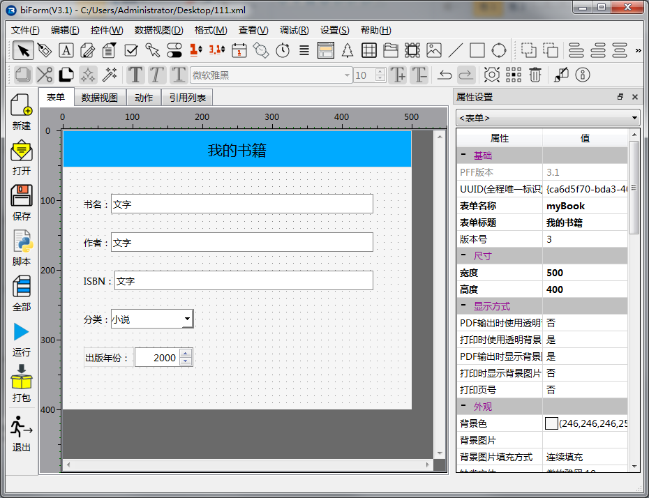

# 设计表单界面

## 添加控件

上一节我们讲到表结构，只有五个字段。

- “书名”、“作者”、“ISBN”是文本型的，用**文本输入**控件。

- “分类”我们希望使用**下拉列表框**，让用户从“小说/历史/科学/技术”这几项中取值。

- “出版年份”我们用**整数编辑器**。因为这个控件没有标题，所以另外添加一个**标签**控件做为标题。

-  添加一个**标签**控件做为表单的标题

在表单上添加好以上控件。

## 调整属性

- 几个**文本输入**控件需要按以下表格修改一下控件名称和标题等属性：

<table>
	<tr>
		<th>字段</th>
		<th>控件名称</th>
		<th>标题</th>
		<th>最大长度</th>
	</tr>
	<tr>
		<td>书名</td>
		<td>leName</td>
		<td>书名：</td>
		<td>30</td>
	</tr>
	<tr>
		<td>作者</td>
		<td>leAuthor</td>
		<td>作者：</td>
		<td>30</td>
	</tr>
	<tr>
		<td>ISBN</td>
		<td>leISBN</td>
		<td>ISBN：</td>
		<td>20</td>
	</tr>
</table>

**最大长度**是指输入时最多可以输入多少个字符。

**下拉列表框**这个控件也需要修改一下属性：

<table>
	<tr>
		<th>属性</th>
		<th>值</th>
	</tr>
	<tr>
		<td>控件名称</td>
		<td>cbClass</td>
	</tr>
	<tr>
		<td>标题</td>
		<td>分类：</td>
	</tr>
</table>

- **下拉列表框**这个控件需要设置一下下拉列表中显示的项目清单。方法是双击这个控件，弹出以下的对话框：

按照以下清单设置添加各个项目：

<table>
	<tr>
		<th>文字</th>
		<th>值</th>
	</tr>
	<tr>
		<td>小说</td>
		<td>小说</td>
	</tr>
	<tr>
		<td>历史</td>
		<td>历史</td>
	</tr>
	<tr>
		<td>科学</td>
		<td>科学</td>
	</tr>
	<tr>
		<td>技术</td>
		<td>技术</td>
	</tr>
</table>

其中“文字”指在下拉列表框中看得到的选项，“值”是指这个项目的内部的值。我们这里把“文字”和“值”设成一样。

如何设置下拉列表框，取决于最后存入数据库时是采用“文字”还是“值”，可以按你的需要进行灵活设置。比如若希望在数据库中以“1/2/3/4”对应这四个分类，就可以将“值”分别设置为“1/2/3/4”，然后保存时取下拉列表框的“值”就可以了。

在本例中，我们希望存入数据库是直接使用“小说/历史/科学/技术”，所以按以上的方式设置就可以了。

- “出版年份”的**整数编辑器**控件修改以下属性：

<table>
	<tr>
		<th>属性</th>
		<th>值</th>
	</tr>
	<tr>
		<td>控件名称</td>
		<td>spYear</td>
	</tr>
	<tr>
		<td>加框可见</td>
		<td>是</td>
	</tr>
	<tr>
		<td>最大值</td>
		<td>2100</td>
	</tr>
	<tr>
		<td>最小值</td>
		<td>1900</td>
	</tr>
	<tr>
		<td>默认整数值</td>
		<td>2000</td>
	</tr>
</table>

- “出版年份”的**标签**控件修改以下属性：

<table>
	<tr>
		<th>属性</th>
		<th>值</th>
	</tr>
	<tr>
		<td>控件名称</td>
		<td>laYear</td>
	</tr>
	<tr>
		<td>标题</td>
		<td>出版年份：</td>
	</tr>
</table>

- 做为表单标题的**标签**控件修改以下属性：

<table>
	<tr>
		<th>属性</th>
		<th>值</th>
	</tr>
	<tr>
		<td>背景颜色</td>
		<td>(0,170,255,255)或你喜欢的其它颜色</td>
	</tr>
	<tr>
		<td>填充类型</td>
		<td>填充</td>
	</tr>
	<tr>
		<td>标题</td>
		<td>我的书籍</td>
	</tr>
	<tr>
		<td>字体</td>
		<td>微软雅黑,16</td>
	</tr>
	<tr>
		<td>水平对齐方式</td>
		<td>居中</td>
	</tr>
	<tr>
		<td>垂直对齐方式</td>
		<td>居中</td>
	</tr>
</table>

修改完后，大概样子是这样的：

## 调整一下表单的属性

<table>
	<tr>
		<th>属性</th>
		<th>值</th>
	</tr>
	<tr>
		<td>表单名称</td>
		<td>myBook</td>
	</tr>
	<tr>
		<td>表单标题</td>
		<td>我的书籍</td>
	</tr>
	<tr>
		<td>宽度</td>
		<td>5000</td>
	</tr>
	<tr>
		<td>高度</td>
		<td>400</td>
	</tr>
</table>

## 调整一下外观

调整一下各个控件的位置和大小，让整个界面更美观一点。

通过以上步骤，最终表单的设计界面如下：

