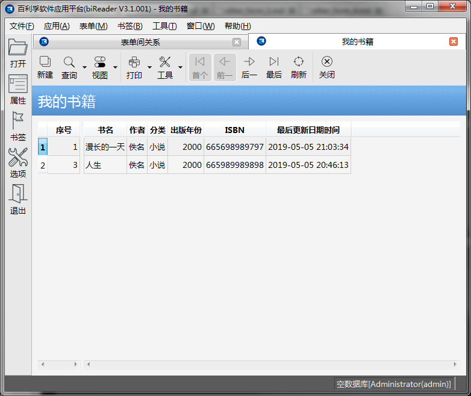

# 打开其它表单并转到列表状态

**我的书籍**表单除了可以用于录入记录，也可以用于显示书籍清单。

有时，我们希望打开这个表单时就直接显示为“列表模式”，并且只显示一部分记录。

以下脚本用于打开**我的书籍**表单，并只显示所**有分类是“小说”**的那些记录，并且以列表方式显示。

在按钮 **"我的书籍"中所有"小说"的列表** 的clicked事件中写入脚本：

``` python 
	pub.openFormList("{ca6d5f70-bda3-40d0-87d5-9e4af44c3f7e}","t0.fclass='小说'")
```

openFormList函数的第一个参数是表单**我的书籍**的UUID。

第二个参数是过滤条件，相当于SQL语句中where子句的内容，但不需要带where关键字。

要注意过滤条件中 fclass 前有个前缀 **t0.** 。

在 biReader 中，如果需要通过脚本返回过滤条件等，主表在SQL语句中的别名都是“t0”。

如果这个表单只有一个主表，没有其它非基础表，可以不用写 **t0.** 前缀。但保持这个习惯更好，有更好的容错性，避免以后数据视图修改后还要再改脚本。

运行后显示的 **我的书籍** 表单看起来就是这样的：




